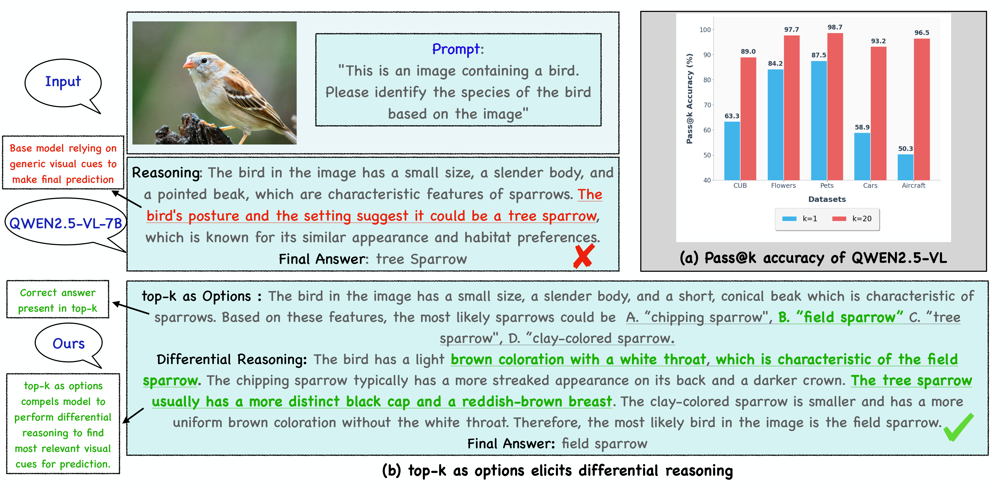

# DiVE-k: Differential Visual Reasoning For Fine-Grained Image Recognition [ICLR 2026]

we propose **DiVE-k** framework (**Di**fferential **V**isual r**E**asoning using top-**k** generations) addressing a key weakness in large vision-language models: their struggle with fine-grained distinctions. Our analysis reveals that simply having world knowledge isn't enough; the model needs to learn how to apply it with precision. **DiVE-k** treats base model's top-k generations, obtained via $K$ rollouts, as training primitive that enables differential visual reasoning. 

<div align="center">
  <a href="https://arxiv.org/abs/2511.18305v1">
    
  </a>
  <a href="https://github.com/raja-kumar/DiVE-k">
    
  </a>
  <a href="https://www.alphaxiv.org/resources/2511.18305v1">
    
  </a>
  
</div>

## Example of DiVE-k differential reasoning



## Data

Please follow [this link](https://github.com/muzairkhattak/PromptSRC/blob/main/docs/DATASETS.md) to prepare the datasets. For CUB, Download the images and annotations from [here](https://www.vision.caltech.edu/datasets/cub_200_2011/).

We also provide pre-processed data at [this hf collection](https://huggingface.co/collections/raja-kumar/dive-k) for QWEN2.5-VL-7B model.

## Pretrained Models

Pretrained models is released at [this hf collection](https://huggingface.co/collections/raja-kumar/dive-k)

## 1. Installation

### Docker Setup
We recommend using Docker to ensure a consistent environment.

**Clone**

```
git clone https://github.com/raja-kumar/DiVE-k
cd DiVE-k
```

**Build the image:**
```bash
docker build --build-arg CACHE_BUSTER=$(date +%s) -t dive_k .
```

**Run the container:**
Replace the placeholders (e.g., `/path/to/...`) with your local paths.

```bash
docker run --rm --gpus all --shm-size=10g \
    -v /path/to/local/repo:/app/DiVE-k \
    -v /path/to/data_root:/data2/ \
    -v /path/to/hf_cache:/root/.cache/huggingface/ \
    -v /path/to/saved_models:/app/saved_models \
    -it dive_k bash
```

## 2. Prepare Data

### Directory Structure
Data must be arranged in the following format under your `data_root`:

```text
<data_root>/
└── <dataset_name>/             # e.g., CUB_200_2011
    ├── zero_shot/
    │   ├── subsample_{split}.json  # e.g., subsample_base_train.json
    │   ├── base_categories.txt
    │   └── new_categories.txt
    └── fewshot/
        ├── 4_shots_all_train.json
        └── all_categories.txt
```

## 3. Generate MCQ

(Note: You can skip this step if you are using our provided MCQ data).

**Step 1: Add Prompts**
Add or modify your prompts in `prompts.py`.

**Step 2: Run Generator**
Navigate to the generation directory inside the container and run the script:

```bash
cd /app/DiVE-k/topk-mcq-data
python generate_mcq.py --mcq_type qwen --data <DATASET_NAME> --split base --phase train
```
*(Example usage: `--data CUB_200_2011`)*

**Step 3: Build HuggingFace Dataset**
Convert the generated JSON to a HuggingFace dataset:

```bash
python build_hf_dataset.py <data_root>/<dataset_name>/qwen_mcq/subsample_base_train_qwen_mcq.json
```

## 4. GRPO training

To train the model:

Sample training script:

1. Open `scripts/others/test.sh`.
2. Modify the variables `DATA_PATH`, `SAVE_PATH`, and `RUN_NAME` to match your specific experiment.
3. Run the script:

```bash
bash scripts/others/test.sh
```

## Evaluation

We provide evaluation script for both one step and two step inference. Modify the path in bash scripts and run

Two Step Inference

```
cd eval
./two_step_inference.sh
```

One Step Inference

```
./one_step_inference.sh
```

After inference is completed, output is saved as a json file. Use LLM eval script to get accuracy

```
./run_llm_eval.sh
```

## Inference

We provide sample inference under demo. modify ```main``` based on your input

```
cd demo
python inference.py
```

## Citation

```
@article{kumar2025dive,
  title={DiVE-k: Differential Visual Reasoning for Fine-grained Image Recognition},
  author={Kumar, Raja and Sadhu, Arka and Nevatia, Ram},
  journal={arXiv preprint arXiv:2511.18305},
  year={2025}
}
```

## Attributions

This repo uses code from [Visual-RFT](https://github.com/Liuziyu77/Visual-RFT). We would like to thank the authors for their amazing work.
